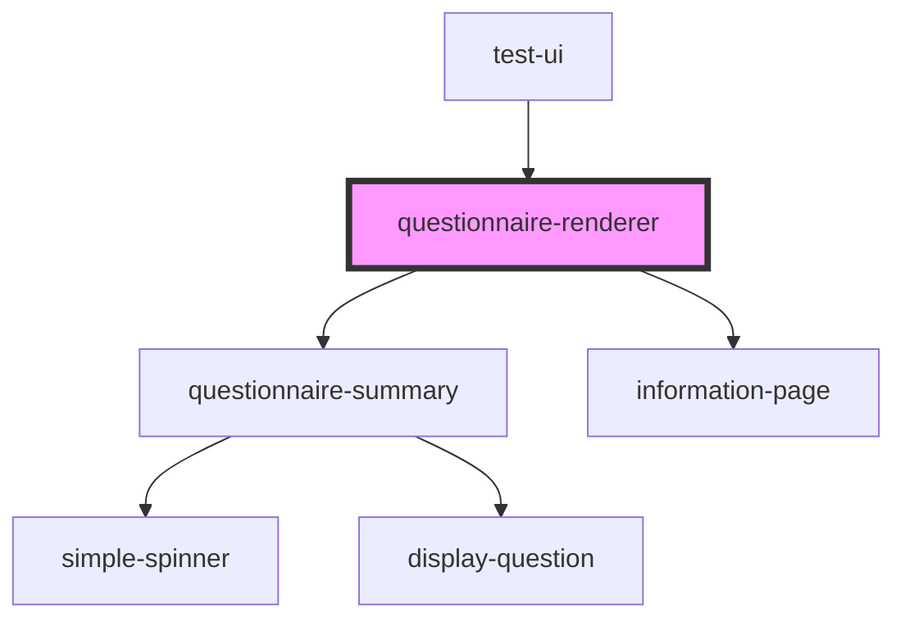

# questionnaire-renderer

<!-- Auto Generated Below -->

## Properties

| Property                          | Attribute                            | Description                                                                                                                                                         | Type      | Default                   |
| --------------------------------- | ------------------------------------ | ------------------------------------------------------------------------------------------------------------------------------------------------------------------- | --------- | ------------------------- |
| `baseUrl`                         | `base-url`                           | FHIR-Base Url                                                                                                                                                       | `string`  | `undefined`               |
| `basicAuth`                       | `basic-auth`                         | If basicAuth is true, the authorization header in server requests will be set to "Basic "                                                                           | `boolean` | `false`                   |
| `danger`                          | `danger`                             | Color used to symbolise danger                                                                                                                                      | `string`  | `undefined`               |
| `editMode`                        | `edit-mode`                          | If true the render will show the button to exit the renderer. It can be used in combination with the summary to edit answers.                                       | `boolean` | `false`                   |
| `enableErrorConsoleLogging`       | `enable-error-console-logging`       | Allows the renderer to show errors in the console while emitting error-events                                                                                       | `boolean` | `false`                   |
| `enableExpand`                    | `enable-expand`                      | If true, enables the renderer to expand valueSets to also load included code systems                                                                                | `boolean` | `true`                    |
| `enableFinishButton`              | `enable-finish-button`               | Shows a finish-button instead of next at the last question                                                                                                          | `boolean` | `false`                   |
| `enableFullQuestionnaireResponse` | `enable-full-questionnaire-response` | If true the Renderer will return a QuestionnaireResponse with all items, even if some items have been deactivated by enableWhen                                     | `boolean` | `false`                   |
| `enableGroupDescription`          | `enable-group-description`           | If true, shows the description of the group for every question thats part of the group                                                                              | `boolean` | `true`                    |
| `enableInformalLocale`            | `enable-informal-locale`             | If true enables the use of the informalLocal - only available for german translation                                                                                | `boolean` | `false`                   |
| `enableInformationPage`           | `enable-information-page`            | If true enables the renderer to show the informationPage                                                                                                            | `boolean` | `false`                   |
| `enableNext`                      | `enable-next`                        | Enable the button that can be used to show the summary or end the questionnaire.                                                                                    | `boolean` | `true`                    |
| `enableReturn`                    | `enable-return`                      | Enable the return-button to exit the render-view. This will also enable the "exit"-Event to be thrown if the information-page is deactivated.                       | `boolean` | `true`                    |
| `enableSendQuestionnaireResponse` | `enable-send-questionnaire-response` | If true, enables the summary to send QuestionnaireResponses to the FHIR Server. Needs the fhir-base url to be able send to the server                               | `boolean` | `true`                    |
| `enableSummary`                   | `enable-summary`                     | Enable the summary. The summary will be shown if enableSummary is true                                                                                              | `boolean` | `false`                   |
| `informationPageText`             | `information-page-text`              | Text shown in the top half of the information page                                                                                                                  | `string`  | `null`                    |
| `lastQuestion`                    | `last-question`                      | If true, the Renderer will start with the last question                                                                                                             | `boolean` | `false`                   |
| `locale`                          | `locale`                             | Language property of the component.   Currently suported: [de, en, es]                                                                                          | `string`  | `'en'`                    |
| `mode`                            | `mode`                               | Current type of Questionnaire-Style to display Available: stepper-questionnaire, grouped-questionnaire, full-questionnaire                                          | `string`  | `'stepper-questionnaire'` |
| `primary`                         | `primary`                            | Primary color                                                                                                                                                       | `string`  | `undefined`               |
| `questionnaire`                   | `questionnaire`                      | FHIR-Resource Questionnaire                                                                                                                                         | `any`     | `null`                    |
| `questionnaireResponse`           | `questionnaire-response`             | FHIR-Resource QuestionnaireResponse                                                                                                                                 | `any`     | `null`                    |
| `questionnaireResponseStatus`     | `questionnaire-response-status`      | If set, will change the status of the questionnaireResponse to the given string value                                                                               | `string`  | `undefined`               |
| `questionnaireUrl`                | `questionnaire-url`                  | The Url to fetch the Questionnaire from                                                                                                                             | `string`  | `null`                    |
| `questionnaireUrlIdentifier`      | `questionnaire-url-identifier`       | Canonical identifier for this questionnaire, represented as a URI. If provided will be used to fetch the questionnaire from the fhir server using the provided url. | `string`  | `undefined`               |
| `secondary`                       | `secondary`                          | Secondary color                                                                                                                                                     | `string`  | `undefined`               |
| `showOnlySummary`                 | `show-only-summary`                  | If showOnlySummary is true, the questionnaire-renderer will only show the summary                                                                                   | `boolean` | `false`                   |
| `showSummaryRemarks`              | `show-summary-remarks`               | if true shows the remarks at the bottom of the summary                                                                                                              | `boolean` | `false`                   |
| `startQuestion`                   | --                                   | The question where in the list of questions the renderer should start. Expects the question as an object.                                                           | `Object`  | `null`                    |
| `subject`                         | `subject`                            | FHIR-Resource Patient                                                                                                                                               | `any`     | `null`                    |
| `summaryText`                     | `summary-text`                       | The text shown in the top half of the Summary                                                                                                                       | `string`  | `null`                    |
| `task`                            | `task`                               | FHIR-Resource Task                                                                                                                                                  | `any`     | `null`                    |
| `token`                           | `token`                              | A token that can be send with server-requests                                                                                                                       | `string`  | `undefined`               |
| `trademarkText`                   | `trademark-text`                     | Shows a trademark/copyright text at the bottom of the renderer                                                                                                      | `string`  | `null`                    |
| `valueSets`                       | --                                   | Array of ValueSets that are needed to display the given questionnaire                                                                                               | `any[]`   | `null`                    |
| `variant`                         | `variant`                            |                                                                                                                                                                     | `any`     | `'Touch'`                 |
| `vasSelectedValueLabel`           | `vas-selected-value-label`           | Text for the label of the selected value                                                                                                                            | `string`  | `null`                    |
| `vasShowSelectedValue`            | `vas-show-selected-value`            | If true shows the selected value for the vas scale                                                                                                                  | `boolean` | `false`                   |
| `vasVertical`                     | `vas-vertical`                       | Options for Visual Analog Scale                                                                                                                                     | `boolean` | `false`                   |
| `visibleBooleanNullOption`        | `visible-boolean-null-option`        | If true shows a third 'no Answer' option in boolean questions.                                                                                                      | `boolean` | `true`                    |

## Events

| Event          | Description                                                                                                                                                                                             | Type               |
| -------------- | ------------------------------------------------------------------------------------------------------------------------------------------------------------------------------------------------------- | ------------------ |
| `addRemarks`   | Emits the addRemarks if the "remarks"-button in the summary as been pressed.                                                                                                                            | `CustomEvent<any>` |
| `closeSummary` | Emits an event to close the summary                                                                                                                                                                     | `CustomEvent<any>` |
| `errorLog`     | Emits an error-event                                                                                                                                                                                    | `CustomEvent<any>` |
| `exit`         | Emits an Event to exit the Renderer. Contains the current questionnaireResponse                                                                                                                         | `CustomEvent<any>` |
| `finished`     | The "finished"-event is thrown once the next button is pressed or in case of the summary the save-button. It contains the current questionnaireResponse with the status "completed"                     | `CustomEvent<any>` |
| `updated`      | The "updated"-event is thrown everytime if the internal questionnaireResponse changes (every time an answer value has changed) and contains the current questionnaireResponse with status "in-progress" | `CustomEvent<any>` |

## Dependencies

### Used by

 - [test-ui](../test-ui)

### Depends on

- [questionnaire-summary](../questionnaire-summary)
- [information-page](../questionnaire/information-page)

### Graph

----------------------------------------------

*Built with [StencilJS](https://stenciljs.com/)*
