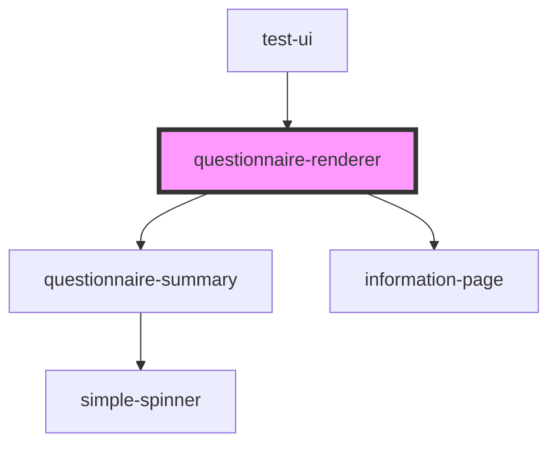

# questionnaire-renderer

<!-- Auto Generated Below -->

## Properties

| Property                          | Attribute                            | Description                                                                                                                     | Type      | Default                   |
| --------------------------------- | ------------------------------------ | ------------------------------------------------------------------------------------------------------------------------------- | --------- | ------------------------- |
| `baseUrl`                         | `base-url`                           | FHIR-Base Url                                                                                                                   | `string`  | `undefined`               |
| `basicAuth`                       | `basic-auth`                         | If basicAuth is true, the authorization header in server requests will be set to "Basic "                                       | `boolean` | `false`                   |
| `danger`                          | `danger`                             | Color used to symbolise danger                                                                                                  | `string`  | `undefined`               |
| `editMode`                        | `edit-mode`                          | If true the render will show the button to exit the renderer                                                                    | `boolean` | `false`                   |
| `enableFullQuestionnaireResponse` | `enable-full-questionnaire-response` | If true the Renderer will return a QuestionnaireResponse with all items, even if some items have been deactivated by enableWhen | `boolean` | `false`                   |
| `enableInformalLocale`            | `enable-informal-locale`             |                                                                                                                                 | `boolean` | `false`                   |
| `enableInformationPage`           | `enable-information-page`            |                                                                                                                                 | `boolean` | `false`                   |
| `enableNext`                      | `enable-next`                        | Enable the button that can be used to show the summary or end the questionnaire                                                 | `boolean` | `true`                    |
| `enableReturn`                    | `enable-return`                      | Enable the return-button to exit the render-view                                                                                | `boolean` | `true`                    |
| `enableSendQuestionnaireResponse` | `enable-send-questionnaire-response` |                                                                                                                                 | `boolean` | `true`                    |
| `enableSummary`                   | `enable-summary`                     | Enable the summary. The summary will be shown if enableSummary is true                                                          | `boolean` | `false`                   |
| `informationPageText`             | `information-page-text`              |                                                                                                                                 | `string`  | `null`                    |
| `lastQuestion`                    | `last-question`                      | If true, the Renderer will show the last question                                                                               | `boolean` | `false`                   |
| `locale`                          | `locale`                             | Language property of the component.   Currently suported: [de, en, es]                                                      | `string`  | `'en'`                    |
| `mode`                            | `mode`                               | Current type of Questionnaire-Style to display Available: stepper-questionnaire, grouped-questionnaire, full-questionnaire      | `string`  | `'stepper-questionnaire'` |
| `primary`                         | `primary`                            | Primary color                                                                                                                   | `string`  | `undefined`               |
| `questionnaire`                   | `questionnaire`                      | FHIR-Resource Questionnaire                                                                                                     | `any`     | `null`                    |
| `questionnaireResponse`           | `questionnaire-response`             | FHIR-Resource QuestionnaireResponse                                                                                             | `any`     | `null`                    |
| `questionnaireUrl`                | `questionnaire-url`                  | The Url to fetch the Questionnaire from                                                                                         | `string`  | `null`                    |
| `secondary`                       | `secondary`                          | Secondary color                                                                                                                 | `string`  | `undefined`               |
| `showOnlySummary`                 | `show-only-summary`                  | If showOnlySummary is true, the questionnaire-renderer will only show the summary                                               | `boolean` | `false`                   |
| `showSummaryRemarks`              | `show-summary-remarks`               |                                                                                                                                 | `boolean` | `false`                   |
| `startQuestion`                   | --                                   | ID of the question in the ItemList where in the list of questions the renderer should start                                     | `Object`  | `null`                    |
| `subject`                         | `subject`                            | FHIR-Resource Patient                                                                                                           | `any`     | `null`                    |
| `summaryText`                     | `summary-text`                       |                                                                                                                                 | `string`  | `null`                    |
| `task`                            | `task`                               | FHIR-Resource Task                                                                                                              | `any`     | `null`                    |
| `token`                           | `token`                              | A token that can be send with server-requests                                                                                   | `string`  | `undefined`               |
| `valueSets`                       | --                                   | List of ValueSets that are needed to display the given questionnaire                                                            | `any[]`   | `null`                    |
| `variant`                         | `variant`                            |                                                                                                                                 | `any`     | `'Touch'`                 |
| `vasShowSelectedValue`            | `vas-show-selected-value`            |                                                                                                                                 | `boolean` | `false`                   |
| `vasVertical`                     | `vas-vertical`                       | Options for Visual Analog Scale                                                                                                 | `boolean` | `false`                   |

## Events

| Event          | Description                         | Type               |
| -------------- | ----------------------------------- | ------------------ |
| `addRemarks`   |                                     | `CustomEvent<any>` |
| `closeSummary` |                                     | `CustomEvent<any>` |
| `error`        | Emits an error-event                | `CustomEvent<any>` |
| `exit`         | Emits an Event to exit the Renderer | `CustomEvent<any>` |
| `finished`     |                                     | `CustomEvent<any>` |
| `updated`      |                                     | `CustomEvent<any>` |

## Dependencies

### Used by

 - [test-ui](../test-ui)

### Depends on

- [questionnaire-summary](../questionnaire-summary)
- [information-page](../questionnaire/information-page)

### Graph

----------------------------------------------

*Built with [StencilJS](https://stenciljs.com/)*
