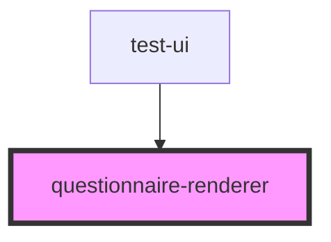

# questionnaire-renderer

<!-- Auto Generated Below -->

## Properties

| Property                | Attribute                | Description                                                                                                                | Type      | Default                  |
| ----------------------- | ------------------------ | -------------------------------------------------------------------------------------------------------------------------- | --------- | ------------------------ |
| `baseUrl`               | `base-url`               | FHIR-Base Url                                                                                                              | `string`  | `undefined`              |
| `danger`                | `danger`                 | Color used to symbolise danger                                                                                             | `string`  | `undefined`              |
| `editMode`              | `edit-mode`              | If true the render will show the button to exit the renderer                                                               | `boolean` | `false`                  |
| `enableReturn`          | `enable-return`          | Enable the return-button to exit the render-view                                                                           | `boolean` | `true`                   |
| `lastQuestion`          | `last-question`          | If true, the Renderer will show the last question                                                                          | `boolean` | `false`                  |
| `locale`                | `locale`                 | Language property of the component.   Currently suported: [de, en, es]                                                 | `string`  | `'en'`                   |
| `mode`                  | `mode`                   | Current type of Questionnaire-Style to display Available: stepper-questionnaire, grouped-questionnaire, full-questionnaire | `string`  | `'StepperQuestionnaire'` |
| `primary`               | `primary`                | Primary color                                                                                                              | `string`  | `undefined`              |
| `questionnaire`         | `questionnaire`          | FHIR-Resource Questionnaire                                                                                                | `any`     | `null`                   |
| `questionnaireResponse` | `questionnaire-response` | FHIR-Resource QuestionnaireResponse                                                                                        | `any`     | `null`                   |
| `questionnaireUrl`      | `questionnaire-url`      | The Url to fetch the Questionnaire from                                                                                    | `string`  | `null`                   |
| `secondary`             | `secondary`              | Secondary color                                                                                                            | `string`  | `undefined`              |
| `startQuestion`         | --                       | ID of the question in the ItemList where in the list of questions the renderer should start                                | `Object`  | `null`                   |
| `subject`               | `subject`                | FHIR-Resource Patient                                                                                                      | `any`     | `null`                   |
| `valueSets`             | --                       | List of ValueSets that are needed to display the given questionnaire                                                       | `any[]`   | `null`                   |

## Events

| Event      | Description                         | Type               |
| ---------- | ----------------------------------- | ------------------ |
| `exit`     | Emits an Event to exit the Renderer | `CustomEvent<any>` |
| `finished` |                                     | `CustomEvent<any>` |
| `updated`  |                                     | `CustomEvent<any>` |

## Dependencies

### Used by

 - [test-ui](../test-ui)

### Graph

----------------------------------------------

*Built with [StencilJS](https://stenciljs.com/)*
