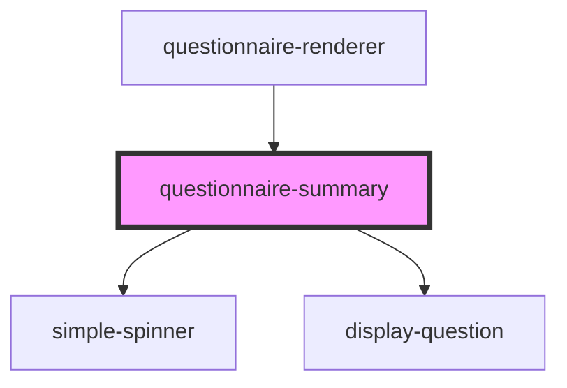

# boolean-question

<!-- Auto Generated Below -->

## Properties

| Property                          | Attribute                            | Description                                                                | Type      | Default     |
| --------------------------------- | ------------------------------------ | -------------------------------------------------------------------------- | --------- | ----------- |
| `baseUrl`                         | `base-url`                           |                                                                            | `string`  | `undefined` |
| `basicAuth`                       | `basic-auth`                         |                                                                            | `boolean` | `undefined` |
| `demoMode`                        | --                                   |                                                                            | `Boolean` | `undefined` |
| `editable`                        | `editable`                           |                                                                            | `boolean` | `undefined` |
| `enableErrorConsoleLogging`       | `enable-error-console-logging`       |                                                                            | `boolean` | `undefined` |
| `enableInformalLocale`            | `enable-informal-locale`             |                                                                            | `boolean` | `undefined` |
| `enableSendQuestionnaireResponse` | `enable-send-questionnaire-response` |                                                                            | `boolean` | `undefined` |
| `locale`                          | `locale`                             | Language property of the component.   Currently suported: [de, en, es] | `string`  | `'en'`      |
| `mode`                            | `mode`                               |                                                                            | `string`  | `undefined` |
| `questionnaire`                   | `questionnaire`                      |                                                                            | `any`     | `null`      |
| `questionnaireResponse`           | `questionnaire-response`             |                                                                            | `any`     | `null`      |
| `showSummaryRemarks`              | `show-summary-remarks`               |                                                                            | `boolean` | `undefined` |
| `subject`                         | --                                   | FHIR Patient-Resource                                                      | `Object`  | `undefined` |
| `summary_text`                    | `summary_text`                       |                                                                            | `string`  | `undefined` |
| `task`                            | `task`                               |                                                                            | `any`     | `undefined` |
| `token`                           | `token`                              |                                                                            | `string`  | `undefined` |
| `trademarkText`                   | `trademark-text`                     |                                                                            | `string`  | `null`      |

## Events

| Event                     | Description                                                               | Type               |
| ------------------------- | ------------------------------------------------------------------------- | ------------------ |
| `addRemarks`              |                                                                           | `CustomEvent<any>` |
| `closeSummary`            |                                                                           | `CustomEvent<any>` |
| `editQuestion`            | Emits an event to return to the questionnaire renderer to edit a question | `CustomEvent<any>` |
| `errorLog`                | Emits an error-event                                                      | `CustomEvent<any>` |
| `finishQuestionnaire`     |                                                                           | `CustomEvent<any>` |
| `finishTask`              |                                                                           | `CustomEvent<any>` |
| `toQuestionnaireRenderer` | Emits an event to return to the questionnaire renderer                    | `CustomEvent<any>` |

## Dependencies

### Used by

 - [questionnaire-renderer](../questionnaire-renderer)

### Depends on

- [simple-spinner](../ui/simple-spinner)
- [display-question](../questions/display-question)

### Graph

----------------------------------------------

*Built with [StencilJS](https://stenciljs.com/)*
