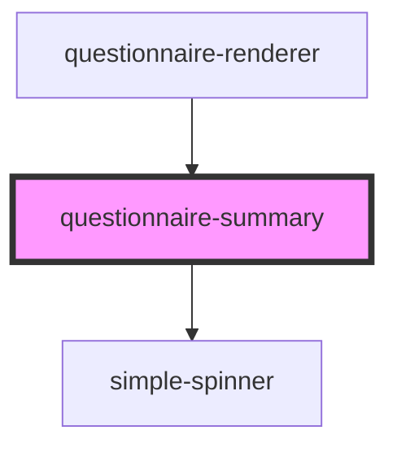

# boolean-question

<!-- Auto Generated Below -->

## Properties

| Property                | Attribute                | Description                                                                | Type      | Default     |
| ----------------------- | ------------------------ | -------------------------------------------------------------------------- | --------- | ----------- |
| `baseUrl`               | `base-url`               |                                                                            | `string`  | `undefined` |
| `basicAuth`             | `basic-auth`             |                                                                            | `boolean` | `undefined` |
| `demoMode`              | --                       |                                                                            | `Boolean` | `undefined` |
| `editable`              | `editable`               |                                                                            | `boolean` | `undefined` |
| `locale`                | `locale`                 | Language property of the component.   Currently suported: [de, en, es] | `string`  | `'en'`      |
| `mode`                  | `mode`                   |                                                                            | `string`  | `undefined` |
| `questionnaire`         | `questionnaire`          |                                                                            | `any`     | `null`      |
| `questionnaireResponse` | `questionnaire-response` |                                                                            | `any`     | `null`      |
| `subject`               | --                       | FHIR Patient-Resource                                                      | `Object`  | `undefined` |
| `summary_text`          | `summary_text`           |                                                                            | `string`  | `undefined` |
| `task`                  | `task`                   |                                                                            | `any`     | `undefined` |
| `token`                 | `token`                  |                                                                            | `string`  | `undefined` |

## Events

| Event                     | Description                                                               | Type               |
| ------------------------- | ------------------------------------------------------------------------- | ------------------ |
| `editQuestion`            | Emits an event to return to the questionnaire renderer to edit a question | `CustomEvent<any>` |
| `error`                   |                                                                           | `CustomEvent<any>` |
| `finishQuestionnaire`     |                                                                           | `CustomEvent<any>` |
| `finishTask`              |                                                                           | `CustomEvent<any>` |
| `toQuestionnaireRenderer` | Emits an event to return to the questionnaire renderer                    | `CustomEvent<any>` |

## Dependencies

### Used by

 - [questionnaire-renderer](../questionnaire-renderer)

### Depends on

- [simple-spinner](../ui/simple-spinner)

### Graph

----------------------------------------------

*Built with [StencilJS](https://stenciljs.com/)*
