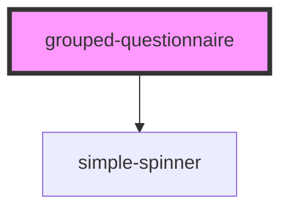

# grouped-questionnaire

<!-- Auto Generated Below -->

## Properties

| Property                     | Attribute       | Description                                                                | Type      | Default     |
| ---------------------------- | --------------- | -------------------------------------------------------------------------- | --------- | ----------- |
| `baseUrl`                    | `base-url`      |                                                                            | `string`  | `undefined` |
| `danger`                     | `danger`        | Color used to symbolise danger                                             | `string`  | `undefined` |
| `editMode`                   | `edit-mode`     |                                                                            | `boolean` | `false`     |
| `enableReturn`               | `enable-return` | Language property of the component.   Currently suported: [de, en, es] | `boolean` | `true`      |
| `filteredItemList`           | --              |                                                                            | `any[]`   | `undefined` |
| `lastQuestion`               | `last-question` |                                                                            | `boolean` | `false`     |
| `locale`                     | `locale`        |                                                                            | `string`  | `'en'`      |
| `primary`                    | `primary`       | Primary color                                                              | `string`  | `undefined` |
| `questionnaire` _(required)_ | `questionnaire` |                                                                            | `any`     | `undefined` |
| `questionnaireResponse`      | --              |                                                                            | `Object`  | `null`      |
| `requiredQuestionList`       | --              |                                                                            | `any[]`   | `undefined` |
| `secondary`                  | `secondary`     | Secondary color                                                            | `string`  | `undefined` |
| `spinner`                    | `spinner`       |                                                                            | `any`     | `undefined` |
| `startCount`                 | `start-count`   |                                                                            | `number`  | `undefined` |
| `valueSets`                  | --              |                                                                            | `any[]`   | `undefined` |
| `variant`                    | `variant`       |                                                                            | `any`     | `null`      |

## Events

| Event     | Description                     | Type               |
| --------- | ------------------------------- | ------------------ |
| `finish`  | Counts up the Question-Number   | `CustomEvent<any>` |
| `return`  | Counts down the Question-Number | `CustomEvent<any>` |
| `summary` |                                 | `CustomEvent<any>` |

## Dependencies

### Depends on

- [simple-spinner](../../ui/simple-spinner)

### Graph

----------------------------------------------

*Built with [StencilJS](https://stenciljs.com/)*
