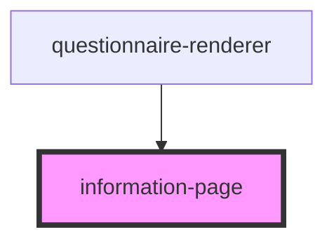

# information-page

<!-- Auto Generated Below -->

## Properties

| Property                    | Attribute                      | Description                                                                | Type      | Default     |
| --------------------------- | ------------------------------ | -------------------------------------------------------------------------- | --------- | ----------- |
| `enableErrorConsoleLogging` | `enable-error-console-logging` |                                                                            | `boolean` | `undefined` |
| `enableInformalLocale`      | `enable-informal-locale`       |                                                                            | `boolean` | `false`     |
| `filteredItemList`          | --                             |                                                                            | `any[]`   | `undefined` |
| `informationPageText`       | --                             |                                                                            | `String`  | `''`        |
| `locale`                    | `locale`                       | Language property of the component.   Currently suported: [de, en, es] | `string`  | `'en'`      |
| `questionnaire`             | `questionnaire`                |                                                                            | `any`     | `null`      |
| `trademarkText`             | `trademark-text`               |                                                                            | `string`  | `null`      |

## Events

| Event                | Description | Type               |
| -------------------- | ----------- | ------------------ |
| `startQuestionnaire` |             | `CustomEvent<any>` |

## Dependencies

### Used by

 - [questionnaire-renderer](../../questionnaire-renderer)

### Graph

----------------------------------------------

*Built with [StencilJS](https://stenciljs.com/)*
