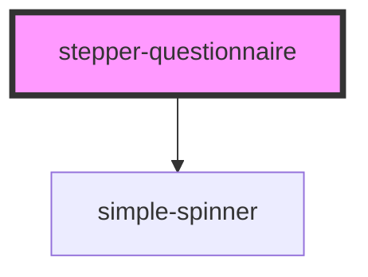

# stepper-questionnaire

<!-- Auto Generated Below -->

## Properties

| Property                     | Attribute                  | Description                                                                | Type      | Default     |
| ---------------------------- | -------------------------- | -------------------------------------------------------------------------- | --------- | ----------- |
| `baseUrl`                    | `base-url`                 |                                                                            | `string`  | `undefined` |
| `danger`                     | `danger`                   | Color used to symbolise danger                                             | `string`  | `undefined` |
| `editMode`                   | `edit-mode`                |                                                                            | `boolean` | `false`     |
| `enableGroupDescription`     | `enable-group-description` |                                                                            | `boolean` | `undefined` |
| `enableInformalLocale`       | `enable-informal-locale`   |                                                                            | `boolean` | `undefined` |
| `enableNext`                 | `enable-next`              |                                                                            | `boolean` | `true`      |
| `enableReturn`               | `enable-return`            |                                                                            | `boolean` | `true`      |
| `enableSummary`              | `enable-summary`           | Language property of the component.   Currently suported: [de, en, es] | `boolean` | `true`      |
| `filteredItemList`           | --                         |                                                                            | `any[]`   | `undefined` |
| `lastQuestion`               | `last-question`            |                                                                            | `boolean` | `false`     |
| `locale`                     | `locale`                   |                                                                            | `string`  | `'en'`      |
| `primary`                    | `primary`                  | Primary color                                                              | `string`  | `undefined` |
| `questionnaire` _(required)_ | `questionnaire`            |                                                                            | `any`     | `undefined` |
| `questionnaireResponse`      | --                         |                                                                            | `Object`  | `null`      |
| `requiredQuestionList`       | --                         |                                                                            | `any[]`   | `undefined` |
| `secondary`                  | `secondary`                | Secondary color                                                            | `string`  | `undefined` |
| `spinner`                    | `spinner`                  |                                                                            | `any`     | `undefined` |
| `startCount`                 | `start-count`              |                                                                            | `number`  | `undefined` |
| `trademarkText`              | `trademark-text`           |                                                                            | `string`  | `null`      |
| `valueSets`                  | --                         |                                                                            | `any[]`   | `undefined` |
| `variant`                    | `variant`                  |                                                                            | `any`     | `null`      |
| `vasSelectedValueLabel`      | `vas-selected-value-label` |                                                                            | `string`  | `undefined` |
| `vasShowSelectedValue`       | `vas-show-selected-value`  |                                                                            | `boolean` | `undefined` |
| `vasVertical`                | `vas-vertical`             | Options for Visual Analog Scale                                            | `boolean` | `undefined` |

## Events

| Event     | Description | Type               |
| --------- | ----------- | ------------------ |
| `finish`  |             | `CustomEvent<any>` |
| `return`  |             | `CustomEvent<any>` |
| `summary` |             | `CustomEvent<any>` |

## Dependencies

### Depends on

- [simple-spinner](../../ui/simple-spinner)

### Graph

----------------------------------------------

*Built with [StencilJS](https://stenciljs.com/)*
