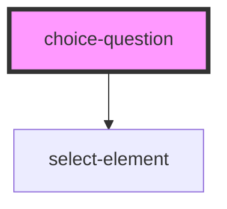

# choice-question

<!-- Auto Generated Below -->

## Properties

| Property                    | Attribute                      | Description                                                                | Type      | Default                        |
| --------------------------- | ------------------------------ | -------------------------------------------------------------------------- | --------- | ------------------------------ |
| `answers`                   | `answers`                      |                                                                            | `any`     | `undefined`                    |
| `baseUrl`                   | `base-url`                     |                                                                            | `string`  | `'https://fhir.molit.eu/fhir'` |
| `danger`                    | `danger`                       | Color used to symbolise danger                                             | `string`  | `undefined`                    |
| `enableErrorConsoleLogging` | `enable-error-console-logging` |                                                                            | `boolean` | `undefined`                    |
| `enableInformalLocale`      | `enable-informal-locale`       |                                                                            | `boolean` | `undefined`                    |
| `locale`                    | `locale`                       | Language property of the component.   Currently suported: [de, en, es] | `string`  | `'en'`                         |
| `mode`                      | `mode`                         |                                                                            | `string`  | `undefined`                    |
| `primary`                   | `primary`                      | Primary color                                                              | `string`  | `undefined`                    |
| `question`                  | `question`                     |                                                                            | `any`     | `undefined`                    |
| `questionnaire`             | `questionnaire`                |                                                                            | `any`     | `undefined`                    |
| `questionnaireResponse`     | --                             |                                                                            | `Object`  | `null`                         |
| `secondary`                 | `secondary`                    | Secondary color                                                            | `string`  | `undefined`                    |
| `valueSets`                 | --                             |                                                                            | `any[]`   | `undefined`                    |

## Events

| Event                      | Description          | Type               |
| -------------------------- | -------------------- | ------------------ |
| `emitAnswer`               |                      | `CustomEvent<any>` |
| `emitRemoveRequiredAnswer` |                      | `CustomEvent<any>` |
| `errorLog`                 | Emits an error-event | `CustomEvent<any>` |

## Dependencies

### Depends on

- [select-element](../../ui/select-element)

### Graph

----------------------------------------------

*Built with [StencilJS](https://stenciljs.com/)*
