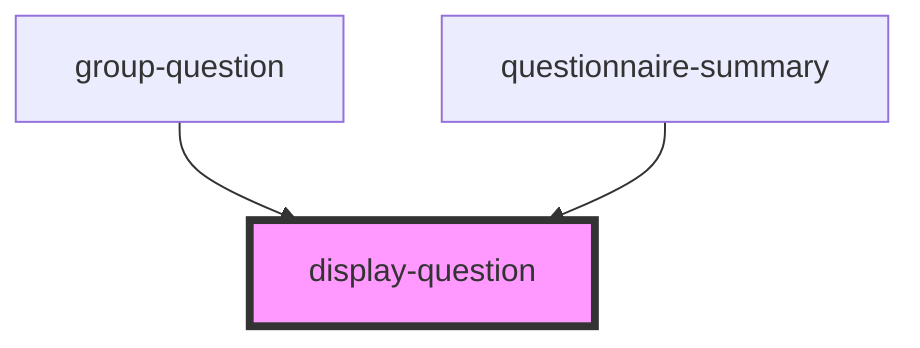

# display-question

<!-- Auto Generated Below -->

## Properties

| Property                    | Attribute                      | Description                                                                | Type      | Default     |
| --------------------------- | ------------------------------ | -------------------------------------------------------------------------- | --------- | ----------- |
| `enableErrorConsoleLogging` | `enable-error-console-logging` |                                                                            | `boolean` | `undefined` |
| `enableInformalLocale`      | `enable-informal-locale`       |                                                                            | `boolean` | `undefined` |
| `locale`                    | `locale`                       | Language property of the component.   Currently suported: [de, en, es] | `string`  | `'en'`      |
| `mode`                      | `mode`                         |                                                                            | `string`  | `undefined` |
| `question`                  | `question`                     |                                                                            | `any`     | `undefined` |

## Events

| Event      | Description          | Type               |
| ---------- | -------------------- | ------------------ |
| `errorLog` | Emits an error-event | `CustomEvent<any>` |

## Dependencies

### Used by

 - [group-question](../group-question)
 - [questionnaire-summary](../../questionnaire-summary)

### Graph

----------------------------------------------

*Built with [StencilJS](https://stenciljs.com/)*
