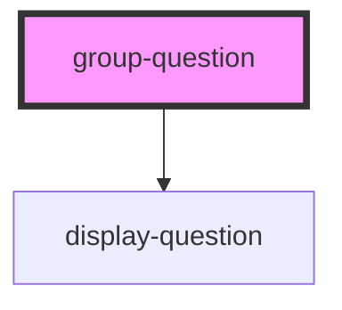

# group-question

<!-- Auto Generated Below -->

## Properties

| Property                     | Attribute                | Description                                                                | Type      | Default     |
| ---------------------------- | ------------------------ | -------------------------------------------------------------------------- | --------- | ----------- |
| `baseUrl`                    | `base-url`               |                                                                            | `string`  | `undefined` |
| `danger`                     | `danger`                 | Color used to symbolise danger                                             | `string`  | `undefined` |
| `editMode`                   | `edit-mode`              |                                                                            | `boolean` | `false`     |
| `enableInformalLocale`       | `enable-informal-locale` |                                                                            | `boolean` | `undefined` |
| `enableReturn`               | `enable-return`          |                                                                            | `boolean` | `true`      |
| `filteredItemList`           | --                       |                                                                            | `any[]`   | `undefined` |
| `lastQuestion`               | `last-question`          |                                                                            | `boolean` | `false`     |
| `locale`                     | `locale`                 | Language property of the component.   Currently suported: [de, en, es] | `string`  | `'en'`      |
| `mode`                       | `mode`                   |                                                                            | `string`  | `undefined` |
| `primary`                    | `primary`                | Primary color                                                              | `string`  | `undefined` |
| `question`                   | `question`               |                                                                            | `any`     | `undefined` |
| `questionnaire` _(required)_ | `questionnaire`          |                                                                            | `any`     | `undefined` |
| `questionnaireResponse`      | --                       |                                                                            | `Object`  | `null`      |
| `requiredQuestionList`       | --                       |                                                                            | `any[]`   | `undefined` |
| `secondary`                  | `secondary`              | Secondary color                                                            | `string`  | `undefined` |
| `startCount`                 | --                       |                                                                            | `Number`  | `undefined` |
| `valueSets`                  | --                       |                                                                            | `any[]`   | `undefined` |
| `variant`                    | `variant`                |                                                                            | `any`     | `null`      |

## Events

| Event                      | Description                                                                                                         | Type               |
| -------------------------- | ------------------------------------------------------------------------------------------------------------------- | ------------------ |
| `addRequiredAnswer`        | Emits new Event to give the required Question to Parent-Component to be added to the List of answered Questions     | `CustomEvent<any>` |
| `emitRemoveRequiredAnswer` | Emits new Event to give the required Question to Parent-Component to be removed from the List of answered Questions | `CustomEvent<any>` |

## Dependencies

### Depends on

- [display-question](../display-question)

### Graph

----------------------------------------------

*Built with [StencilJS](https://stenciljs.com/)*
