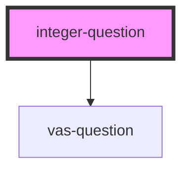

# integer-question

<!-- Auto Generated Below -->

## Properties

| Property                    | Attribute                      | Description                                                                | Type      | Default     |
| --------------------------- | ------------------------------ | -------------------------------------------------------------------------- | --------- | ----------- |
| `danger`                    | `danger`                       | Color used to symbolise danger                                             | `string`  | `undefined` |
| `enableErrorConsoleLogging` | `enable-error-console-logging` |                                                                            | `boolean` | `undefined` |
| `enableInformalLocale`      | `enable-informal-locale`       |                                                                            | `boolean` | `undefined` |
| `locale`                    | `locale`                       | Language property of the component.   Currently suported: [de, en, es] | `string`  | `'en'`      |
| `mode`                      | `mode`                         |                                                                            | `string`  | `undefined` |
| `primary`                   | `primary`                      | Primary color                                                              | `string`  | `undefined` |
| `question`                  | `question`                     |                                                                            | `any`     | `undefined` |
| `questionnaireResponse`     | --                             |                                                                            | `Object`  | `null`      |
| `secondary`                 | `secondary`                    | Secondary color                                                            | `string`  | `undefined` |
| `vasSelectedValueLabel`     | `vas-selected-value-label`     |                                                                            | `string`  | `undefined` |
| `vasShowSelectedValue`      | `vas-show-selected-value`      |                                                                            | `boolean` | `undefined` |
| `vasVertical`               | `vas-vertical`                 | Options for Visual Analog Scale                                            | `boolean` | `undefined` |

## Events

| Event        | Description                                 | Type               |
| ------------ | ------------------------------------------- | ------------------ |
| `emitAnswer` |                                             | `CustomEvent<any>` |
| `emitNext`   | Handles KeyPresses by adding Eventlisteners | `CustomEvent<any>` |
| `errorLog`   | Emits an error-event                        | `CustomEvent<any>` |

## Dependencies

### Depends on

- [vas-question](../vas-question)

### Graph

----------------------------------------------

*Built with [StencilJS](https://stenciljs.com/)*
