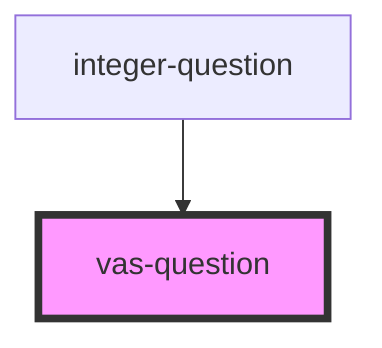

# vas-question

<!-- Auto Generated Below -->

## Properties

| Property     | Attribute  | Description | Type     | Default         |
| ------------ | ---------- | ----------- | -------- | --------------- |
| `labelLower` | --         |             | `String` | `'Lower-bound'` |
| `labelUpper` | --         |             | `String` | `'Upper-bound'` |
| `max`        | `max`      |             | `number` | `100`           |
| `min`        | `min`      |             | `number` | `0`             |
| `selected`   | `selected` |             | `number` | `0`             |
| `step`       | `step`     |             | `number` | `1`             |

## Events

| Event          | Description | Type               |
| -------------- | ----------- | ------------------ |
| `emitSelected` |             | `CustomEvent<any>` |

## Dependencies

### Used by

 - [integer-question](../integer-question)

### Graph

----------------------------------------------

*Built with [StencilJS](https://stenciljs.com/)*
