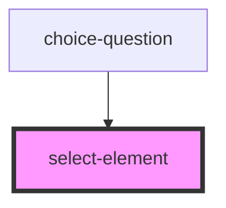

# select-element

<!-- Auto Generated Below -->

## Properties

| Property       | Attribute      | Description | Type      | Default                                                                                                     |
| -------------- | -------------- | ----------- | --------- | ----------------------------------------------------------------------------------------------------------- |
| `optionsList`  | `options-list` |             | `any`     | `undefined`                                                                                                 |
| `repeats`      | --             |             | `Boolean` | `false`                                                                                                     |
| `selected`     | `selected`     |             | `any`     | `undefined`                                                                                                 |
| `translations` | `translations` |             | `any`     | `{     placeholder: 'Please select',     noResults: 'No entries found',     loadingText: 'Loading...',   }` |

## Events

| Event                 | Description | Type               |
| --------------------- | ----------- | ------------------ |
| `emitSelectedChoices` |             | `CustomEvent<any>` |

## Dependencies

### Used by

 - [choice-question](../../questions/choice-question)

### Graph

----------------------------------------------

*Built with [StencilJS](https://stenciljs.com/)*
