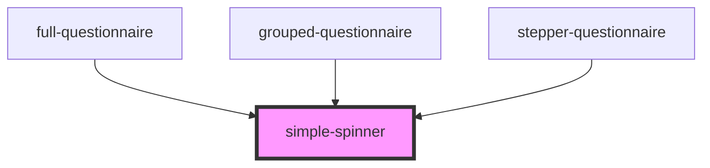

# simple-spinner

<!-- Auto Generated Below -->

## Properties

| Property         | Attribute          | Description | Type     | Default     |
| ---------------- | ------------------ | ----------- | -------- | ----------- |
| `borderTopColor` | `border-top-color` |             | `string` | `'#004A6B'` |
| `message`        | --                 |             | `String` | `undefined` |

## Dependencies

### Used by

 - [full-questionnaire](../../questionnaire/full-questionnaire)
 - [grouped-questionnaire](../../questionnaire/grouped-questionnaire)
 - [stepper-questionnaire](../../questionnaire/stepper-questionnaire)

### Graph

----------------------------------------------

*Built with [StencilJS](https://stenciljs.com/)*
